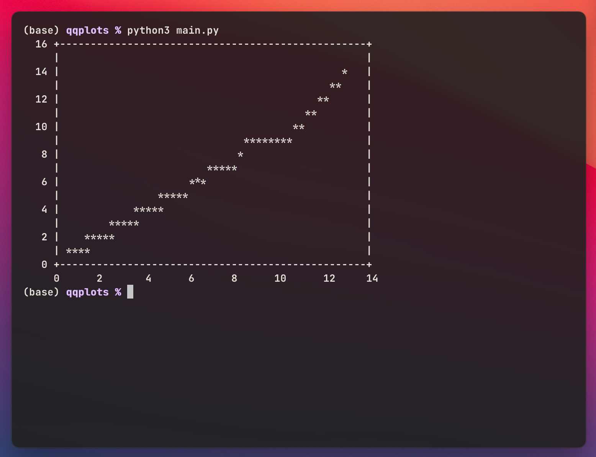

# Visualization of Multivariate Normality

## Summary
`ChiQQ` object will take a numpy.array as the source and draw the Chisquare QQ plot.Check the docstrings for more information.


## Dependencies

In order to draw the QQ plot in the terminal, `gnuplot` is necessary. For mac users,the following package can be installed via MacPorts or HomeBrew. 
```{shell}
brew install gnuplot
```

Also `termplotlib`, `numpy`, `scipy` and `matplotlib` are required to be installed in your python environment.
```{python}
pip install termplotlib numpy scipy matplotlib
```

